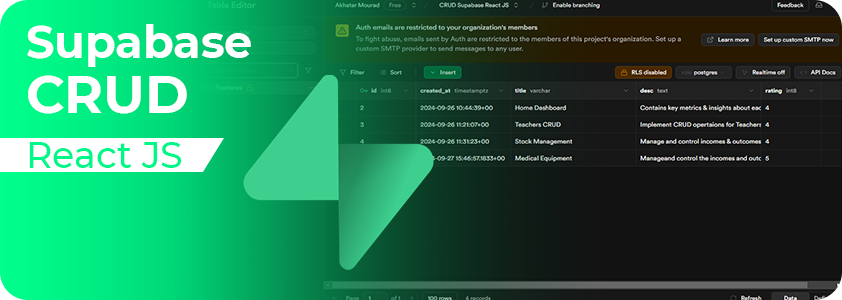
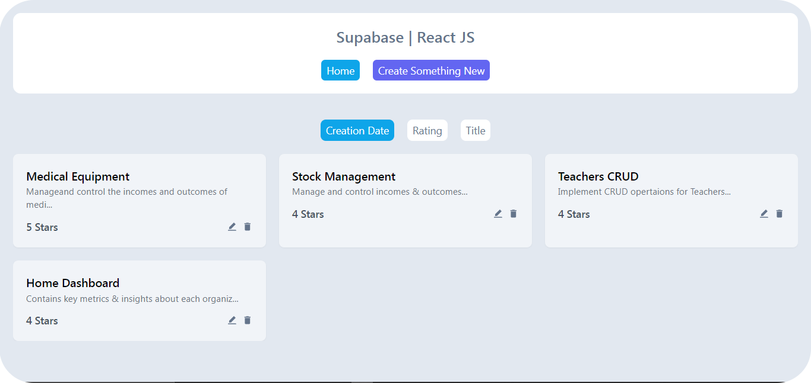
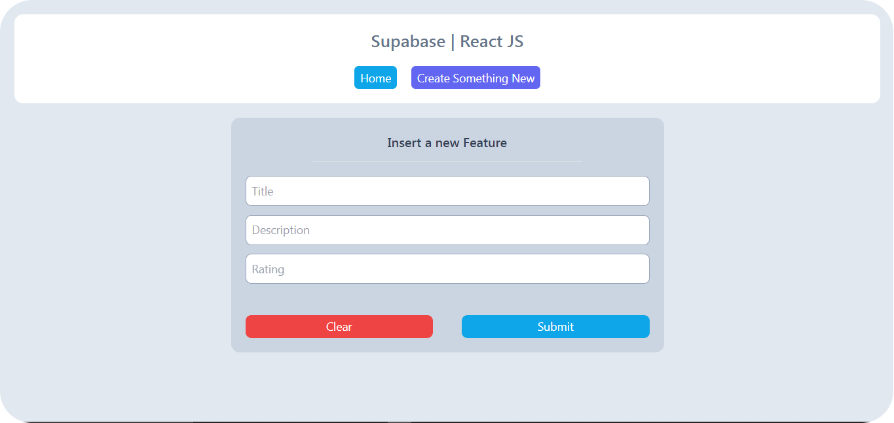
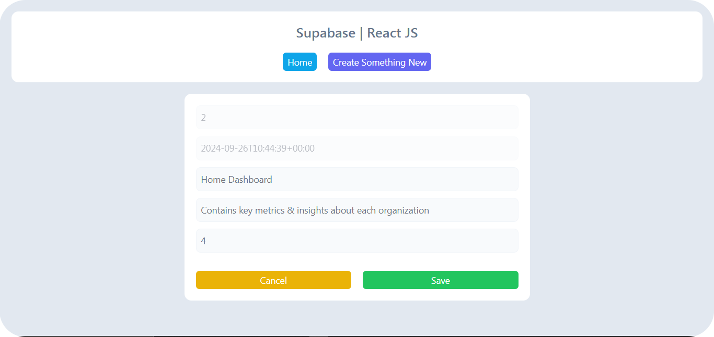

# Supabase CRUD



## Overview

is project is a simple CRUD (Create, Read, Update, Delete) application built using Supabase for the backend, React for the frontend, and Tailwind CSS for styling. The app allows users to perform CRUD operations on a database, with real-time updates and user authentication powered by Supabase. The UI is responsive and clean, styled with Tailwind, offering an efficient user experience.

## Tech Stack

- **Frontend:**

- React: A JavaScript library for building user interfaces.
- Tailwind CSS: A utility-first CSS framework that allows for rapid, responsive, and modern UI design with minimal custom CSS.

- **Backend:** 

- Supabase : A backend-as-a-service built on PostgreSQL, offering real-time database updates, authentication, and storage, making it a complete backend solution without the need for a custom server.

## Demo

The figures below demonstrate the functionality of the CRUD application, along with the Supabase Client Web UI, showcasing the user interface and the process of creating, reading, updating, deleting, and ordering data in real-time.









## Build the Project

I built the project using the following command

```bash
npm run build
```

This command generates a build folder containing optimized static files (HTML, CSS, and JavaScript) for production. The reason for building the project is to ensure that the application is ready for deployment with improved performance, smaller file sizes, and faster load times. The build process removes unnecessary development code, providing an efficient and optimized version of the app for end users.

## Usage

Move to the client folder the use the [npm](https://www.npmjs.com/) to install necessary packages & dependencies.

```bash
npm install
```

Run the application using the following command:

```bash
npm run dev
```

After running the application, you can access the dashboard via the link provided in the console.

## 🔗 Links

[](https://akhatarmourad.github.io/portfolio/)
[](https://www.linkedin.com/in/akhatarmourad/)